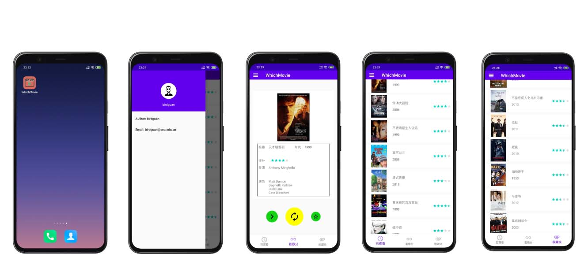

# WHICH FILM，探寻您与一部电影的缘分
  

# Dependencies
- [LitePal 3.1.1](https://github.com/LitePalFramework/LitePal)
- [com.roughike:bottom-bar:2.3.1](com.roughike:bottom-bar:2.3.1)
- OkHttp3
- Picasso
- [CircleButton](https://github.com/markushi/android-circlebutton)

# 功能
## 登录注册

## 翻一部
由于豆瓣电影条目id不连续，无法随机选取，因此爬取了尽可能多的条目保存在阿里云服务器并用python搭建了一个简单的API服务器以返回确定的条目id。  
随机API示例：[http://39.101.204.206:18080/?index=10086](http://39.101.204.206:18080/?index=10086)
### 翻一部流程
1. 使用OkHttp3从阿里云自建的豆瓣电影条目API服务器随机获取条目id

    |名称|说明|类型|
    |:-:|:-:|:-:|
    |index|请求发出的随机索引值，0~138234|String|
    |id|返回的豆瓣电影条目id|String|

2. 将拿到的id组成电影条目详细信息信息请求URL，格式https://api.douban.com/v2/movie/subject/id?apikey=0df993c66c0c636e29ecbb5344252a4a，使用OkHttp3请求
3. 解析豆瓣API返回的json，只获取需要的信息

    |名称|说明|类型|
    |:-:|:-:|:-:|
    |title|电影名称|String|
    |images|电影海报图片地址|JsonObject，只取其中"large"字段|
    |year|电影年代|String|
    |rating|电影评分|JsonObject，只取其中"average"字段|
    |directors|电影导演|JsonArray，只取每个JsonObject中的"name_en"字段|
    |casts|电影演员|JsonArray，只取每个JsonObject中的"name_en"字段|

4. 在Fragment上展示，图片获取使用Picasso

## 已观看和收藏夹SQLite数据库保存
（考虑到快速开发保存到本地数据库，可改为保存到服务器）

# Acknowlege
## 豆瓣api
看到有不少人说豆瓣API无法申请了，其实Github还有[豆瓣API备份文档](http://www.doubanapi.com/movie.html#subject)，  
还给出了apikey:0df993c66c0c636e29ecbb5344252a4a
### 调用格式
https://api.douban.com/v2/movie/subject/**id**?apikey=0df993c66c0c636e29ecbb5344252a4a  
其中**id**需要自己替换。

由于豆瓣电影条目id是不连续的，因此爬取了可访问的id，共计138234条。

# Contact
 **Author:** birdguan  
 **Email:** xuchen_guan@163.com